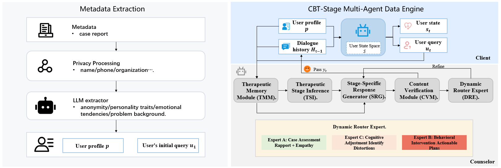

# CBT-Stage-Multi-Agent-Data-Generation-Engine
This repository provides a CBT-stage multi-agent data generation engine and the corresponding synthesized counseling dialogue data for stage-aware Cognitive Behavioral Therapy (CBT) dialogue modeling.

The goal of this project is to construct high-quality psychological counseling dialogues with explicit therapeutic structure.
Instead of generating generic supportive conversations, our engine organizes dialogue synthesis around CBT stages, user psychological states, and stage-specific intervention constraints, making the resulting data more suitable for training and evaluating process-aware mental health dialogue models.


## Overview
Large language models can produce fluent and empathetic responses, but psychological counseling requires more than surface-level support.
A CBT-oriented counseling process involves structured therapeutic goals, progressive user-state changes, and appropriate interventions at different stages.

To support this process-oriented modeling, we build a multi-agent data generation engine that simulates and verifies CBT counseling dialogues through several specialized agents.
The generated data contains explicit annotations such as:

CBT therapeutic stage
User psychological state
Counselor intervention focus
Stage-specific constraints
Multi-turn counseling context
Counselor response
These annotations can be used for supervised fine-tuning, controllable generation, process-level evaluation, or analysis of stage-aware counseling behavior.

## Key Features
CBT-stage-aware dialogue generation
Generates counseling dialogues aligned with predefined CBT therapeutic stages.
User psychological state modeling
Annotates the user's evolving psychological state during the counseling process.
Stage-specific intervention constraints
Provides guidance on what the counselor should or should not do at each stage.
Multi-agent generation framework
Uses multiple specialized agents to construct, refine, and verify counseling dialogues.
Structured training data
Provides data that can be directly used for training stage-aware psychological dialogue models.
Process-oriented supervision
Supports research on procedural fidelity, stage alignment, and session-level coherence in mental health LLMs.

## Repository Contents
```bash
.
├── assets/               # Static assets (images, etc.)
├── components/           # Reusable components (agent modules, etc.)
├── config/               # Configuration files for data generation
├── data/                 # Generated CBT-stage counseling dialogue data
├── engine/               # Multi-agent data generation pipeline
└── README.md
```

## Data Structure

Each sample is a JSON object containing a simulated client profile and a multi-turn CBT-style counseling dialogue.

- `conv_uuid`: unique dialogue ID
- `role_desc`: detailed simulated client background
- `role_character`: user personality or presentation traits
- `problem_types`: main counseling problem category
- `conversation`: list of counseling turns

Each turn in `conversation` contains:

- `turn_id`: turn index
- `emo`: user psychological state
- `phase`: CBT counseling stage
- `human`: user/client utterance
- `assistant`: counselor response


## Installation
Clone the repository and install the required dependencies to build the running environment:
```bash
cd CBT-Stage-Multi-Agent-Data-Generation-Engine
pip install -r requirements.txt
```

## Quick Start
We provide the default running script for one-click data generation. You can adjust the generation quantity, counseling scenarios, CBT intervention stages and other parameters according to your needs:
```python
# Run the multi-agent CBT data generation engine
python generate_sample_data.py
```

## License
This project is licensed under the MIT License. See LICENSE for details.

